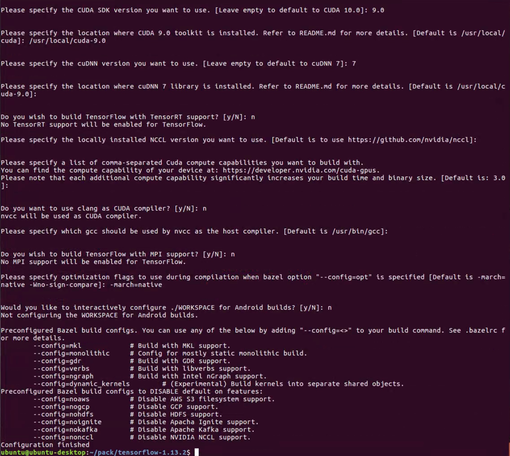

# ubuntu16.04安装tensorflow-gpu 总结

## 安装基础组件
参见《Python深度学习》第284页 附录A.1 安装 Python 科学套件

## 设置GPU支持
参见《Python深度学习》第284页 附录A.2、[源代码编译安装TensorFlow1](https://cloud-atlas.readthedocs.io/zh_CN/latest/machine_learning/build_tensorflow_from_source.html)、[从源码编译安装 Tensorflow2](https://blog.csdn.net/u014475479/article/details/81702392)

老版本gpu，不建议安装太新的 nvidia-xxx \ cuda \ cudnn \ tensorflow，对于gtx770而言，nvidia-384 \ cuda9.0 \ cudnn7 \ tensorflow1.13.2

### 1. 安装gpu驱动
```
$ sudo apt-get install nvidia-384
```
重启，运行`nvidia-smi`命令或到`设置>详细信息`查看驱动安装情况

### 2. **安装cuda**
cuda 各版本下载地址：
	
```
https://developer.nvidia.com/cuda-toolkit-archive
```
下载`cuda-repo-ubuntu1604-9-0-local_9.0.176-1_amd64.deb`，运行一下命令安装：
	
```
$ sudo dpkg -i cuda-repo-ubuntu1604-9-0-local_9.0.176-1_amd64.deb
$ sudo apt-key add 7fa2af80.pub
$ sudo apt-get update
$ sudo apt-get install cuda-9-0
```
配置环境变量，编辑~/.bashrc文件，添加如下内容：
	
```
export PATH=$PATH:/usr/local/cuda-9.0/bin
export CUDA_HOME=/usr/local/cuda-9.0
export LD_LIBRARY_PATH=$LD_LIBRARY_PATH:/usr/local/cuda-9.0/lib64
export LIBRARY_PATH=$LIBRARY_PATH:/usr/local/cuda-9.0/lib64
```
重启，运行`nvidia-smi`命令，查看gpu驱动和cuda安装情况

### 3. **安装cudnn**
cudnn 各版本下载地址，（需要注册nvidia账号）：
	
```
https://developer.nvidia.com/rdp/cudnn-archive
```
下载对应cuda版本的需要的cudnn，`libcudnn7_7.0.5.15-1+cuda9.0_amd64.deb` 以及 `cudnn-9.0-linux-x64-v7.tgz`，运行如下命令：
	
```
$ sudo dpkg -i libcudnn7_7.0.5.15-1+cuda9.0_amd64.deb	# 安装libcudnn
$ tar -zxvf cudnn-9.0-linux-x64-v7.tgz	# 解压，得到cuda目录
$ sudo cp cuda/include/cudnn.h /usr/local/cuda-9.0/include/	# 拷贝cudnn库到cuda目录
$ sudo cp cuda/lib64/libcudnn* /usr/local/cuda-9.0/lib64/	# 拷贝cudnn库到cuda目录
$ sudo chmod a+r /usr/local/cuda-9.0/include/cudnn.h /usr/local/cuda-9.0/lib64/libcudnn* # 添加权限
```

### 4.安装tensorflow
* 普通安装：

```
$ sudo pip3 install tensorflow==<version> 	# cup版本安装
$ sudo pip3 install tensorflow-gpu==<version>	# gpu版本安装
```
对应老显卡而言，虽然也支持CUDA ，但是[某些](https://blog.csdn.net/geyunfei_/article/details/78753899)只能支持CUDA 3.0。而当前最新版本的TensorFlow二进制发行版至少需要CUDA 3.5，普通安装的tensorflow无法使用，所以需要自己编译tensorlfow，[参见1](https://www.tensorflow.org/install/source)、[参见2](https://cloud-atlas.readthedocs.io/zh_CN/latest/machine_learning/build_tensorflow_from_source.html)、[参见3](https://blog.csdn.net/u014475479/article/details/81702392)

* 编译安装

1. [安装Bazel](https://www.jianshu.com/p/d92913173d5b)
		
	到github上下载bazel的0.21.0版本或更低版本的bazel
	执行
	
	```
	$ chmod +x bazel-<version>-installer-linux-x86_64.sh
	$ ./bazel-<version>-installer-linux-x86_64.sh --user	
	```
	该--user标志将Bazel安装到$HOME/bin系统上的目录并设置.bazelrc路径$HOME/.bazelrc。使用该--help命令查看其他安装选项
		
2. 编译安装tensorflow

	到[https://github.com/tensorflow/tensorflow](https://github.com/tensorflow/tensorflow/releases)下载需要版本的tensorflow源码
		
	* 配置编译
	
	```
	$ cd tensorflow-1.13.2
	$ ./configure		# 配置编译
	
	# 配置编译
	# 1.确认python路径：/usr/bin/python3
	# 2.确认python包路径：#回车 <对应python路径>
	# 3...XLA JIT support? [Y/n]: n
	# 4...OpenCl SYCL support? [y/N]: n
	# 5...ROCm support? [y/N]: n
	# 6...CUDA support? [y/N]: y
	# 7...CUDA SDK version...: 9.0	#确认cuda版本
	# 8...location where CUDA 9.0 toolkit ...[Default is ...]: /usr/local/cuda-9.0 	#确认cuda路径
	# 9...cuDNN version...: 7		#确认cudnn版本
	# 10...cuDNN 7 library...[Default is ...]:#回车	#确认cudnn库所在路径，安装cudnn时所拷贝到的路径
	# 11...TensorFlow with TensorRT support? [y/N]:n
	# 12...NCCL version..[Default is to use https://github.com/nvidia/nccl]:#回车
	# 13...comma-separted Cuda compute ... Please note that each ... [Default is: 3.0]: #回车
	# 14...user clang as CUDA compiler? [y/N]:n
	# 15...which gcc should be used by nvcc ...[Default is /usr/bin/gcc]: #回车
	# 16...build TensorFlow with MPI support? [y/N]:n
	# 17...option "--config=opt" is specified[Default is -march=native -Wno-sign-compare]:-march=native
	# 18..../WORKSPACE from Android builds?[y/N]:n
	# 配置编译完成
	```
	
	* 使用bazel开始编译
	
	```
	bazel build --config=opt --config=cuda //tensorflow/tools/pip_package:build_pip_package 
	```
	漫长的等待⌛️...，一个小时后...编译完成，将其大包成whl包
	
	```
	bazel-bin/tensorflow/tools/pip_package/build_pip_package /tmp/tensorflow_pkg
	```
	得到whl包
	
	```
	mv /tmp/tensorflow_pkg/tensorflow-1.13.2-cp35-cp35m-linux_x86_64.whl ~/pack/
	```
	使用pip3 安装
	
	```
	sudo pip3 install tensorflow-1.13.2-cp35-cp35m-linux_x86_64.whl
	```

## 使用gpu运行时

代码需要做如下配置

```
import tensorflow as tf

# 配置gpu训练时内存分配，应该单独学习gpu资源管理，合理分配gpu资源，才能更好的利用，tensorflow还没能在工具层处理这问题，所以才必须在代码中进行配置
config = tf.ConfigProto(log_device_placement=False)    # 是否打印设备分配日志
# config = tf.compat.v1.ConfigProto(log_device_placement=False)    # 是否打印设备分配日志，新版本tensorflow运行时
config.gpu_options.per_process_gpu_memory_fraction=0.5 # 设置每个gpu应该拿出多少容量给进程使用
config.operation_timeout_in_ms=15000   # terminate on long hangs
sess = tf.InteractiveSession("", config=config)
# sess = tf.compat.v1.InteractiveSession("", config=config)	# 新版本tensorflow运行时

```